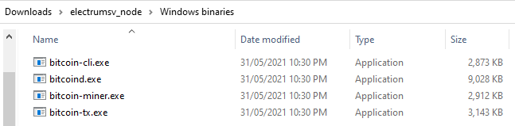
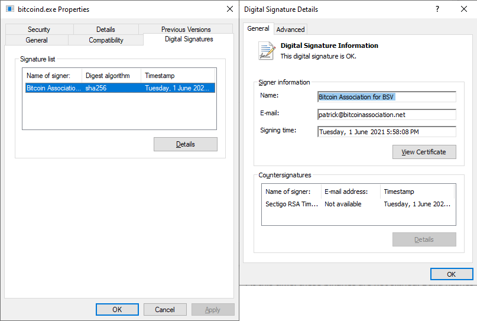

Archived binaries
=================

Originally, the ElectrumSV node project only provided Python packages. However we now also provide
the compiled binaries for MacOS and Windows. We do not provide binaries for Linux as you can
get them from the `official web site`__, and you should always get your node builds from there
if they provide them.

__ https://bitcoinsv.io/

   The Windows archived binaries for a past release.

Verify your download
--------------------

As always, you should not blindly download executable files from web sites and run them. It is
strongly advised you verify these downloaded files before you consider running them.

.. important::
   Bitcoin nodes have been compiled into malware which when deployed onto users computers covertly,
   mine coins for the malware authors. You may get false positives from your virus checking
   software for these builds. Check the binaries are signed where applicable, otherwise check
   the provided checksums for them.

Windows
~~~~~~~

These binaries are currently signed with the code signing certificate the ElectrumSV developers use
for signing the ElectrumSV Windows downloads. You can check these to verify that your downloaded
files are authentic and have not been replaced or tampered with. Instructions on how to check
our digital signatures are given in the `ElectrumSV documentation`__.

__ https://electrumsv.readthedocs.io/en/latest/getting-started/verifying-downloads.html#using-the-digital-signatures

   Checking the digital signature for ElectrumSV as you would for any Windows node binary.

MacOS
~~~~~

At this time, these binaries are not signed. Build hashes will be provided `in our Github
repository`__, and can be used to verify that your downloaded files are authentic and have not
been replaced or tampered with. Instructions on how to get the checksum for a file you have
downloaded are given in the `ElectrumSV documentation`__.

__ http://github.com/electrumsv/electrumsv-node/tree/master/build-hashes.txt
__ https://electrumsv.readthedocs.io/en/latest/getting-started/verifying-downloads.html#shasum

Running the node
----------------

Each Python package contains a Python module and the node binaries for the given platform. The
module is just a simple wrapper that starts and stops running the node, and allows the user to
differentiate the parameters so that they can if necessary run multiple nodes at the same
time. As Python packages are just zip archives, it is possible for a user to download a package
file and extract the included node binaries if they wish.

Running one node instance
~~~~~~~~~~~~~~~~~~~~~~~~~

This project is intended to be used to run local regtest nodes. This example will show
how to run a regtest node, and how to generate blocks and obtain regtest coins using it. The
shown commands will be for Windows, but will work for all supported operating systems.

Create the data directory for your node, let's call it ``data_dir1``::

    > mkdir data_dir1

This is where the node will look for the configuration file, and also put it's own data related
to the blockchain and the log file you can look to see what is going on.

Create a ``data_dir1\bitcoin.conf`` file and place the following inside it::

    server=1
    maxstackmemoryusageconsensus=0
    excessiveblocksize=10000000000
    rpcuser=rpcuser
    rpcpassword=rpcpassword
    txindex=1

The configuration file saves you from having to pass these arguments to ``bitcoind`` every time
you run it.

Starting the node::

    > bitcoind -regtest -datadir=data_dir1 -rpcport=18322

This will do nodey things and prevent any further commands from being entered in the console
until you shut down the node.

Calling the ``getinfo`` RPC method::

    > bitcoin-cli -datadir=data_dir1 -rpcport=18322 getinfo
    {
    "version": 101000800,
    ...
    "walletversion": 160300,
    ...
    "blocks": 0,
    ...
    }

The response indicates that the node is running, that it is version 1.0.8, that the wallet is
compiled into it, and that the no blocks have been mined yet. The `errors` entry is simply because
we did not compile the node as a production build, which this project does not intend to provide.
We will now mine one block to an arbitrary regtest address.

Mining a block::

    > bitcoin-cli -datadir=data_dir1 -rpcport=18322 generatetoaddress 1 mfs8Y8gAwC2vJHCeSXkHs6LF5nu5PA7nxc
    [
    "42e587c8d433663e2bdacc835aef637527da9a0c36d21f5b1b20b34e2ada86a5"
    ]

The response indicates that one block with the given hash was mined. At this point we know how to
start a node and call RPC methods, including generating a block to send coins to one of our
addresses. It is not intended that this documentation illustrate how to use the node RPC methods,
but just to show they can be called in useful ways.

One of the biggest advantages of running a regtest node is that it is your own test blockchain,
and you can reset it any time you want, starting again from a fresh blockchain. First let's
confirm that the local regtest blockchain has a mined block.

    > bitcoin-cli -datadir=data_dir1 -rpcport=18322 getinfo
    {
    ...
    "blocks": 1,
    ...
    }

The cleanest way to shut down your node, is to tell it to stop with the ``bitcoin-cli`` command.

Stopping your node cleanly::

    > bitcoin-cli -datadir=data_dir1 -rpcport=18322 stop
    Bitcoin server stopping

To reset the blockchain, just delete your data directory. The next time you run the node it will
start from scratch with a fresh blockchain.

Running multiple node instances
~~~~~~~~~~~~~~~~~~~~~~~~~~~~~~~

If you are going to run multiple node instances you need to pass unique values for each of the
data directory, the rpc port and the p2p port, for each node.

Edit your ``bitcoin.conf`` file with the following contents::

    server=1
    maxstackmemoryusageconsensus=0
    excessiveblocksize=10000000000
    rpcuser=rpcuser
    rpcpassword=rpcpassword
    txindex=1

Make a data directory for each node,  ``data_dir1`` and ``data_dir2``::

    > mkdir data_dir1
    > mkdir data_dir2

Copy the ``bitcoin.conf`` file into each data directory::

    > copy bitcoin.conf data_dir1
    > copy bitcoin.conf data_dir2

We now need different RPC and P2P ports for each node. The RPC port is the port that we send
commands to the node as a user, to direct it what to do. The P2P port is the port that other
nodes will connect to a node with. We will use 21011 as the RPC port and 21012 as the P2P port
for the first node, and 22011 as the RPC port and 22012 as the P2P port for the second node.

You will need to open two different consoles for the next step, one to start each node in.
Remember that the node blocks the console while it does it's nodey things.

Start the first node::

    > bitcoind -regtest -datadir=data_dir1 -rpcport=21011 -port=21012

Start the second node::

    > bitcoind -regtest -datadir=data_dir2 -rpcport=22011 -port=22012

At this stage, both nodes lack any knowledge of any other node. They have no way to know about
other nodes they can establish P2P connections to, to share transactions and blocks with. As far
as they know they are building their own blockchains in isolation.

We can put them in touch by telling the first node the P2P address (``127.0.0.1:22012``) of the
second node.

Tell the first node about the second node::

    > bitcoin-cli -datadir=data_dir1 -rpcport=21011 addnode 127.0.0.1:22012 add

The first node will now establish an outgoing P2P connection to the second node. You may need to
wait a a little bit for it to happen. If you want to see what is going on, remember that each
node has a log file in their data directory. For the first node this will be
``data_dir1\regtest\bitcoind.log``. You should be able to work out where the second node's log
file is.

Check if the second node is connected to the first node::

    > bitcoin-cli -datadir=data_dir2 -rpcport=22011 getinfo
    {
    ...
    "connections": 1,
    ...
    }

Generate a block on the second node::

    > bitcoin-cli -datadir=data_dir2 -rpcport=22011 generatetoaddress 1 mfs8Y8gAwC2vJHCeSXkHs6LF5nu5PA7nxc
    [
    "21c15b8b895dac4ccd0ae5790c3a0053fc412881ab999ca16b60df8ccdc9462b"
    ]

Whether your two nodes are connected yet, or are in the process of connecting still, the second node
will share this block with the first node shortly after the connection is established.

Check the status of the first node::

    > bitcoin-cli -datadir=data_dir1 -rpcport=21011 getinfo
    {
    ...
    "blocks": 1,
    ...
    }

You can now see that the first node has received the block you had the second node mine. Your local network
of nodes is working. A good next step might be to work out how to cause a reorg in one node, by mining
a forked longer chain in the other.

For now stop your nodes::

    > bitcoin-cli -datadir=data_dir1 -rpcport=21011 stop
    Bitcoin server stopping
    > bitcoin-cli -datadir=data_dir2 -rpcport=22011 stop
    Bitcoin server stopping
